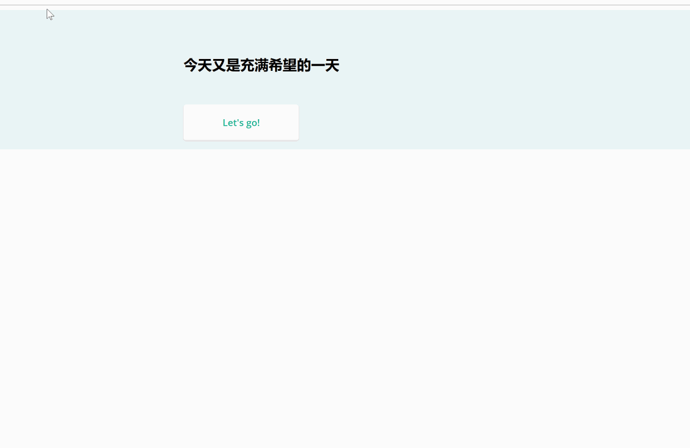

# daily-standup



## Usage
Download the single html file from [release](https://github.com/futuretea/daily-standup/releases)

## Project setup
```
npm install
```

### Compiles and hot-reloads for development
```
npm run serve
```

### Run in Docker
```
docker run -d --name daily-standup -p 8080:8080 futuretea/daily-standup
```